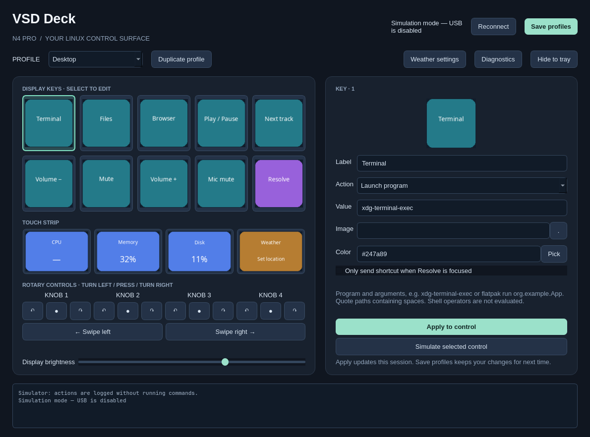

# VSD Deck for Arch Linux

A native Python/Qt controller for the **VSD N4 Pro**. This is an independent Linux
application using the manufacturer's device SDK. The Windows MSI is not needed.

**v0.1.0 · Early preview · MIT licensed**

Tested on x86_64 Omarchy / Hyprland with an N4 Pro (`5548:1023`). Other Linux
desktops and N4 Pro variants may need additional testing. This is an independent
community project, not the official VSD Craft application.



## Install on Arch Linux

Download and extract the source release, or clone this repository. Open a
terminal in the extracted/cloned project directory and run:

```bash
git clone https://github.com/AnthonyMMiller/vsd-deck.git
cd vsd-deck
```

Install the dependencies and configure USB access:

```bash
sudo pacman -Syu --needed python git hidapi libusb playerctl wireplumber wtype xdg-utils xdg-terminal-exec
./setup.sh
sudo install -m 644 packaging/70-vsd-n4-pro.rules /etc/udev/rules.d/70-vsd-n4-pro.rules
sudo udevadm control --reload-rules
```

**Unplug and reconnect the deck**, then launch as your regular user:

```bash
./run.sh
```

To add an application launcher entry:

```bash
python install-desktop.py
```

Keep the project folder in place; the launcher points to it. Setup downloads the
pinned manufacturer SDK and installs Python dependencies in a local `.venv`.
It does not enable autostart. The USB rule grants access to your active desktop
session; do not run the app with `sudo`.

## Features

- Editor for ten display buttons, four touch-strip zones, four rotary knobs,
  and left/right swipes.
- Custom PNG/JPEG/WebP images, tile labels/colors, brightness, saved JSON profiles.
- Program and website launching, keyboard shortcuts, media controls, volume and
  microphone mute. Knob 1 controls volume; knob 2 controls playback by default.
- CPU, memory, and home filesystem usage on the touch strip (3-second updates).
- Open-Meteo weather in Celsius or Fahrenheit (15-minute updates after coordinates
  are configured). Failed refreshes retain the last reading with an asterisk.
- A DaVinci Resolve **keyboard shortcut profile** for transport, in/out marks, save,
  undo, and redo. Focus Resolve before using these controls. Shortcuts are editable
  and depend on your Resolve keyboard preset. This is not a port of the vendor's
  Resolve plugin and does not use Resolve's scripting API.
- Automatic USB reconnect, a tray icon, and a simulator that logs actions without
  launching programs, sending shortcuts, or accessing USB.

## Using the app

Open `VSD Deck` from the application launcher after running `python install-desktop.py`.
Keep this project folder in place; the launcher points to it. The app must remain
running to handle button presses. **Hide to tray** keeps it active; closing quits.
Only one hardware instance is allowed per user session.

For a dry run:

```bash
./run.sh --simulate
```

Click a control to select it, edit its fields, then **Apply to control**. **Save
profiles** persists applied changes. Selecting another control discards unapplied
editor text. Duplicate a profile to create your own layout. Swiping or pressing
the Resolve/Desktop tile switches profiles.

Profiles are stored in `$XDG_CONFIG_HOME/vsd-deck/profiles.json` (normally
`~/.config/vsd-deck/profiles.json`). `--config /path/to/profiles.json` uses another
file. Missing files start with defaults; invalid existing files are left intact.
Custom image paths refer to the original files, so keep those images available.

## Desktop compatibility

On Omarchy, the package helper is `omarchy pkg add <packages...>`.

Wayland shortcuts use `wtype` and require a compositor supporting its virtual
keyboard protocol, including Hyprland. On X11 install `xdotool` instead. Resolve's
focus check currently requires Hyprland. `playerctl` needs an MPRIS-capable player;
`wpctl` controls the default PipeWire output and input. Launching a program uses
its executable and arguments, such as `flatpak run org.example.App`; quote paths
with spaces. Shell operators and environment-variable substitutions are not
evaluated. Use an explicit executable script for more involved automation.

## USB access

The attached N4 Pro was detected as `5548:1023`. Supported variants are
`5548:1008`, `5548:1023`, and `5548:1021`. If connection reports a permission error:

```bash
sudo install -m 644 packaging/70-vsd-n4-pro.rules /etc/udev/rules.d/70-vsd-n4-pro.rules
sudo udevadm control --reload-rules
```

Unplug and reconnect the deck. `./run.sh --diagnostics` should then show
`read_write_access: true` for the HID device. Enumeration alone does **not** prove
that Linux permits the application to send commands. These rules grant the active local session access;
the application should run as your regular user. Close other deck applications
before launching this one. Use **Reconnect** after a transient USB error.

## Validation and limitations

```bash
./run.sh --diagnostics
.venv/bin/python -m unittest discover -s tests -v
QT_QPA_PLATFORM=offscreen QT_QPA_PLATFORMTHEME=basic ./run.sh --simulate --screenshot /tmp/vsd-deck.png
```

Automated tests cover packet mapping, press/release filtering, USB reconnect and
cleanup, image rotation/size, action execution, profile persistence, and data
providers. USB access and display updates were confirmed on an N4 Pro with ID
`5548:1023`, including visible button labels and live system tiles. Check physical
key positions, image orientation, and shortcuts on your particular unit and
desktop. The other USB variants have not had hands-on testing. No firmware or factory settings
are changed. Dynamic screen images and brightness are applied while running.

The SDK's Python and C++ implementations disagree on N4 Pro key mappings; this
adapter follows the C++ packet map and corrects a native HID struct mismatch.
Its native write API also reports queued commands as successful even when it
cannot open the USB interface. The application checks real HID read/write access
before connecting, so missing permissions are reported instead of silently
discarding display updates.
See [THIRD_PARTY.md](THIRD_PARTY.md) for source and license information.

See [CHANGELOG.md](CHANGELOG.md) for release notes and
[CONTRIBUTING.md](CONTRIBUTING.md) for reporting bugs or contributing fixes.
